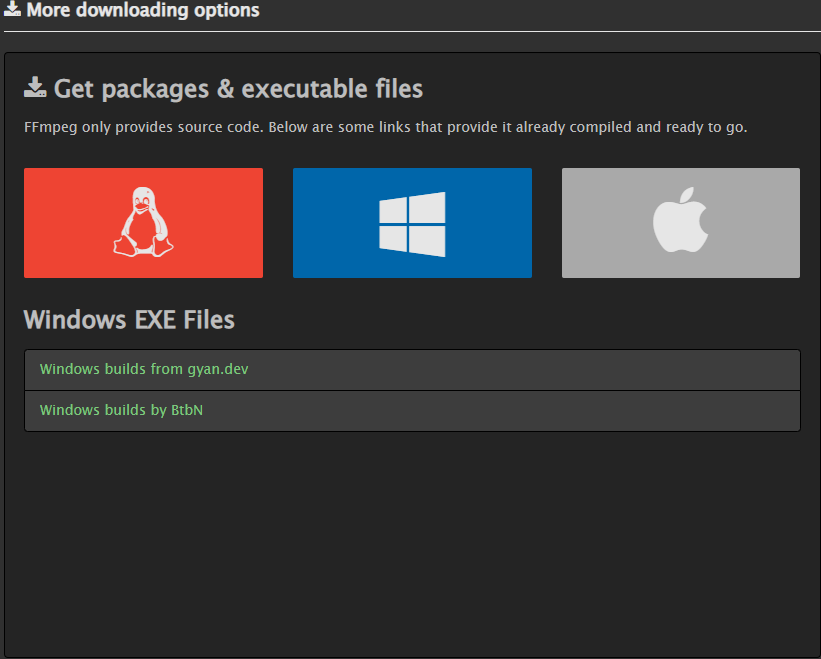
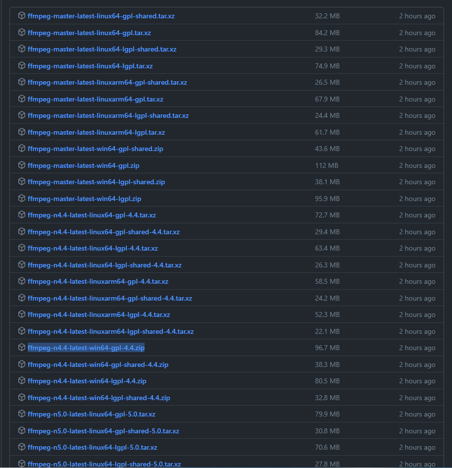
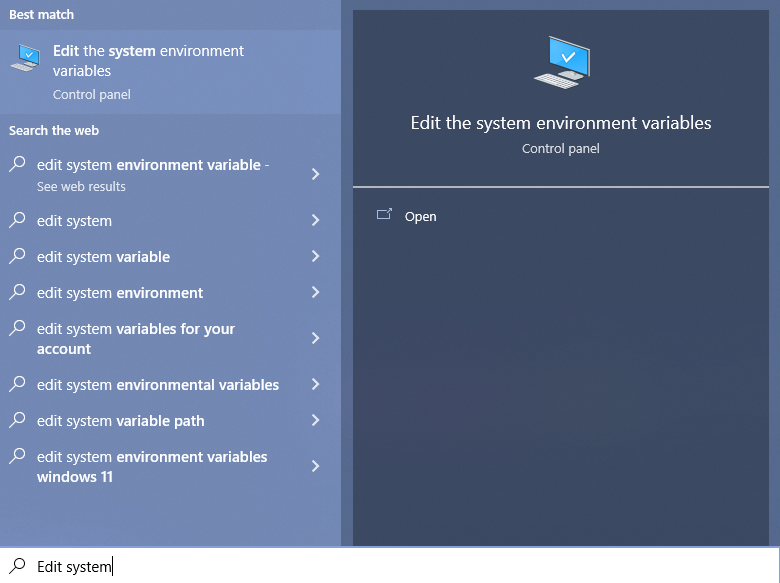
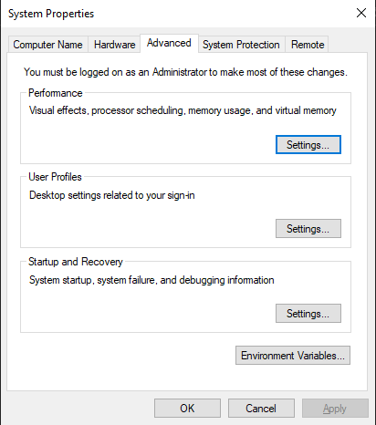
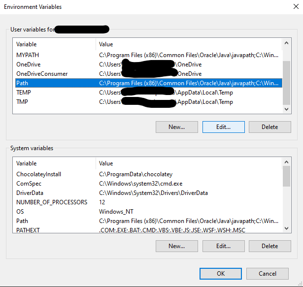
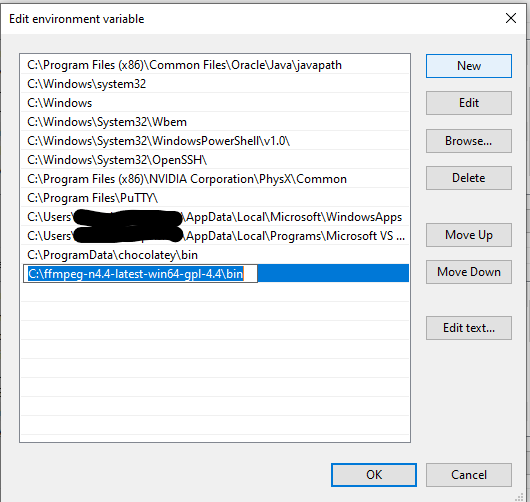
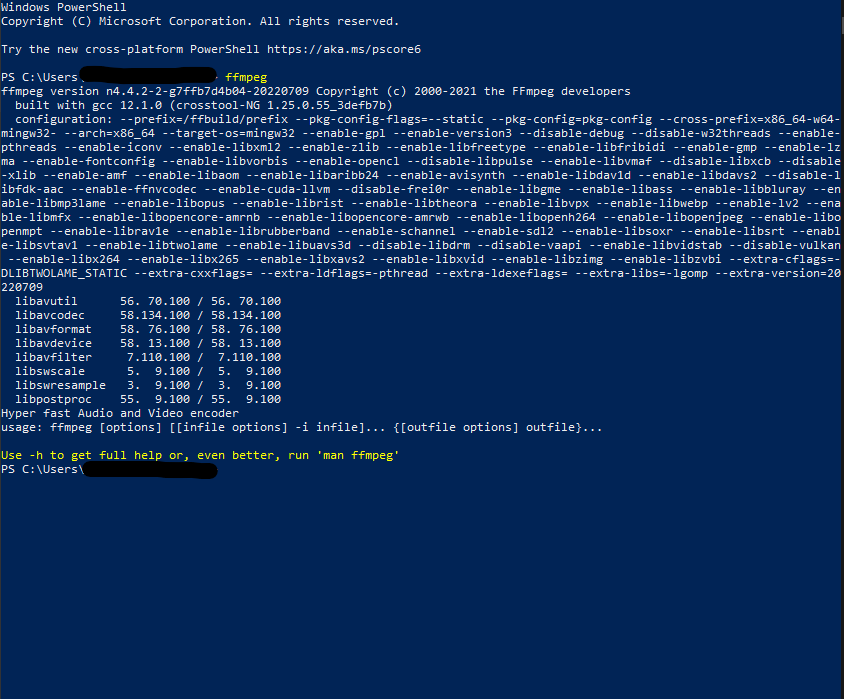

# Simple YTDL CLI

A Simple CLI for the YTDL project. 

## Project Info

**Author**: Aniketh Aatipamula <br>
**Project Start Date**: Febuary 4, 2022 <br>
**Contributors**: N/A <br>

**Project Origin**: I wanted a simpler way to use the yt-dlp project that wouldn't require typing out long commands in the terminal and either navigating or specifying folders I would like content to be downloaded into. 

**Project Description**: This project simplifies the entire process by giving the user 3 predetermined download options. Option one downloads audio in the highest possible quality and then converts it to mp3 before storing it in a specified folder. Option two does the same for video with the content being converted to mp4 instead of mp3. Option three does both simutaenously. 

## Project Notes

**Module Dependencies**: This project requires that a handful of non-standard python modules be installed. <br>
This includes:
- yt-dlp

## Running This Project

**FFmpeg** <br>
This project requires that you install a third-party application called [FFmpeg](https://ffmpeg.org/). <br>

**FFmpeg Windows Install** <br>

Click the following [link](https://ffmpeg.org/download.html#build-windows) and navigate to *More downloading options* and click the Windows logo. From there click *Windows builds by BtbN*.



There are going to be a lot of different files to sort through, if you want to find your own build to download just make sure it is a Windows specific build. Otherwise you can choose the latest stable release and download `ffmpeg-n4.4-latest-win64-gpl-4.4.zip`



Save the zip file to any folder you would like, however I would reccomend saving in your home folder `C:\Users\yourusernamehere\` or the root folder `C:\` if you have admin permissions. Go ahead and unzip the folder after you have saved it. <br>

In order to use FFmpeg from the command line you need to add the bin folder located in the folder you just unzipped. This can be done by hitting the windows key and typing; `Edit system enviornment variables` which should pop up after the first two words or so. Hit enter when this control panel setting pops up.



From there navigate to the *Advanced* tab and hit *Enviornment Variables...*.



Under *User variables for yourusername* click the *Path* variable and hit edit.



In the new window hit the *New* button and then paste in the entire path of the FFmpeg download folder but append `\bin` to the end of it. Hit *OK* on all open the open windows to save your configuration. 



You should now have FFmpeg installed and added to your Path. You can confirm this by opening PowerShell and typing `ffmpeg`, the output should similar to the one below.



**FFmpeg OSX Install** <br>

***If you are using an M1 Mac there are no static builds for ARM processors and you will have to use rosetta or find some other workaround.*** <br>

Click the following [link]() and navigate to *More downloading options* and click the Apple logo. From there click *Static builds for macOS 64-bit*

You can either download the most recent compile from the continously updating github or the most recent release. Either is a fine option and you can download either the .7z or the .zip which is located just below the big .7z download button. If you have no prefrence I would suggest downloading the most recent release, which is *ffmpeg-5.0.1* and I would download the .zip to make extracting the file easy. 

When saving your download I would suggest saving the folder in your home directory which would be `/Users/yourusernamehere`. Go ahead and extract your download as well, you can do this by right clicking the file and hitting extract. 

*You will need admin privileges to do the following*

From here open your terminal and navigate to where you saved your folder. From there you can copy the ffmpeg binary from the `./bin` folder and copy it into the `/usr/share/bin`. The command would look similar to the following from the root folder of the FFmpeg folder. 

```bash
sudo cp ./bin/ffmpeg /usr/share/bin
```

*If you do not have admin privileges to do this or would rather not have to use admin you can also acheive this by editing your shell startup file in order to include the ffmpeg folder.*

To find the shell you are using run the following command: 

```bash
echo $SHELL
```

The output should give you the path to your shell. From there you can edit your startup file using the following command:

```bash
echo "export PATH=\"/full/path/to/ffmpeg/folder/bin:$PATH\"" >>  ~/.zshrc
```

Or if your shell is bash:

```bash
echo "export PATH=\"/full/path/to/ffmpeg/folder/bin:$PATH\"" >>  ~/.bashrc
```

Exit the terminal and startup a new window. Type `ffmpeg` into the command line and if the output is similar to the following it is successfully installed. 